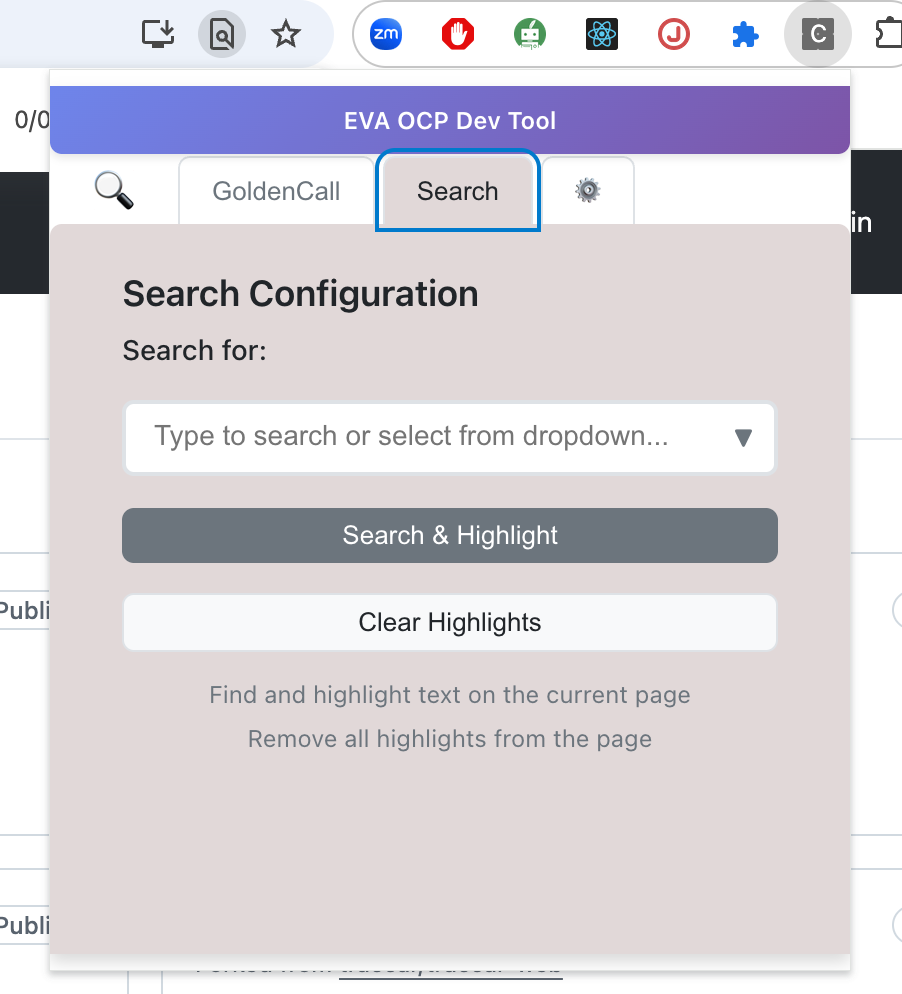

# Content Search Extension

A modern Chrome extension built with **TypeScript**, **React 19**, and **Vite** that allows users to search and highlight content on web pages with configurable options and GitHub integration.

## 🚀 Quick Start

### Prerequisites
- Node.js (v16 or higher)
- npm or yarn
- Chrome browser

### Installation & Setup

1. **Clone the repository**
   ```bash
   git clone <repository-url>
   cd content-search-extension
   ```

2. **Install dependencies**
   ```bash
   npm install
   ```

3. **Build the extension**
   ```bash
   npm run build
   ```

4. **Load in Chrome**
   - Open Chrome and navigate to `chrome://extensions/`
   - Enable "Developer mode" in the top right corner
   - Click "Load unpacked" and select the `dist/` folder
   - The extension icon will appear in the Chrome toolbar

## 🛠️ Development

### Development Commands

| Command | Purpose | Output |
|---------|---------|--------|
| `npm run dev` | Web development mode | `http://localhost:5173` |
| `npm run build` | Build Chrome extension | `dist/` folder |
| `npm run build:web` | Build web app only | `dist/` folder |
| `npm run clean` | Clean build artifacts | - |
| `npm run watch` | Watch mode for development | `dist/` folder |

### Dual-Mode Development

This extension supports **two development modes**:

#### 🌐 **Web Development Mode** (Recommended for UI development)
```bash
npm run dev
```
- **Purpose**: Rapid UI development with hot reload
- **URL**: `http://localhost:5173`
- **Features**: React hot reload, browser DevTools, fast iteration
- **Chrome APIs**: Mocked for web compatibility
- **Storage**: Uses localStorage instead of Chrome storage
- **Visual Indicator**: Shows "🌐 Web Development Mode" banner

#### 🔧 **Chrome Extension Mode** (For testing extension features)
```bash
npm run build
```
- **Purpose**: Test real Chrome extension functionality
- **Output**: Creates extension in `dist/` folder
- **Features**: Real Chrome APIs, content script injection, background script
- **Installation**: Load `dist/` folder as unpacked extension in Chrome

### Why Dual-Mode?

- **10x Faster Development**: Hot reload vs extension reload cycle
- **Better Debugging**: Full browser DevTools access in web mode
- **Flexible Testing**: Test UI in web mode, functionality in extension mode
- **Shared Codebase**: Same React components work in both contexts

## 🏗️ Architecture

### Tech Stack
- **React 19**: Modern React with hooks and functional components
- **TypeScript**: Strict type safety throughout
- **Vite**: Lightning-fast build system with HMR
- **Chrome Extension Manifest V3**: Latest Chrome extension standard

### Project Structure
```
src/
├── popup/                    # React application
│   ├── App.tsx              # Main application component
│   ├── App.css              # Global styles
│   ├── main.tsx             # React entry point
│   ├── index.html           # Popup HTML template
│   └── components/          # React components
│       ├── TabNavigation.tsx    # Tab switching interface
│       ├── SearchTab.tsx        # Search functionality
│       ├── GoldenCallTab.tsx    # GitHub integration
│       ├── ConfigurationTab.tsx # Settings and configuration
│       └── StatusMessage.tsx    # User feedback messages
├── content/                 # Content script
│   ├── content.ts           # Page interaction logic
│   └── content.css          # Highlighting styles
├── background/              # Service worker (unused in current build)
│   └── background.ts
├── services/                # API and business logic
│   ├── chromeExtensionApiService.ts  # CORS bypass service
│   └── goldenCallService.ts          # GitHub integration service
├── types/                   # TypeScript definitions
│   └── index.ts             # Shared type definitions
└── utils/                   # Utilities
    ├── config.ts            # Configuration management
    └── chromeApiWrapper.ts  # Chrome API abstraction
```

### Build Output Structure
```
dist/
├── index.html              # Extension popup (React app)
├── popup.js               # Bundled React application
├── popup.css              # Compiled styles
├── content.js             # Content script
├── content.css            # Content script styles
├── background.js          # Service worker
└── manifest.json          # Chrome extension manifest
```

## ✨ Features

### OCP Log Search
- **Smart Search Interface**: Tabbed interface with Search, Golden Call, and Configuration tabs
- **Predefined Options**: Built-in search options for common terms:
  - `envMode`
  - `featureFlags - Output field params parsed`
  - `keyValuePairs`
  - `ws-request`
  - `ws-response-fields`
  - `ws-response-WsResponseDto`
- **Custom Search**: Type any search term to find and highlight on the page
- **Visual Highlighting**: Matches are highlighted with smooth scrolling to first result
- **Match Counter**: Shows number of matches found with auto-hide
- **Clear Highlights**: Remove all highlights with one click



### OCP Integration (Golden Call)
- **Auto-Detection**: Automatically extracts GitHub username from profile pages
- **Smart Tab Switching**: Automatically switches to Golden Call tab when on GitHub
- **Username Extraction**: Extracts from `<span class="p-nickname vcard-username d-block" itemprop="additionalName">`
- **Manual Input**: Option to manually enter Golden ID
- **Status Feedback**: Visual feedback for successful/failed operations


### Configuration Management
- **JSON Configuration**: Upload custom search configurations via JSON files
- **Tab Behavior Settings**:
  - **Default Tab**: Choose which tab opens by default (Search, Golden Call, or Configuration)
  - **Auto-Switch**: Enable/disable automatic tab switching based on domain
- **Persistent Storage**: Settings are saved using Chrome storage API
- **Domain-Based Logic**: 
  - GitHub domains (`github.com`) → Golden Call tab
  - Emol domains (`emol.com`) → Search tab
  - Other domains → Default tab

## 🔧 Configuration

### Default Tab Behavior

The extension uses intelligent tab selection:

#### **Current Configuration**
- **Default Tab**: Golden Call (`goldencall`)
- **Auto-Switch**: Enabled

#### **Auto-Switch Logic**
1. **GitHub domains** (`github.com`) → **Golden Call tab**
2. **Emol domains** (`.emol.com`) → **Search tab**
3. **Other domains** → **Default tab**

#### **Changing Default Tab**

**Method 1: Through UI (Recommended)**
1. Open the extension popup
2. Go to Configuration tab (⚙️)
3. Scroll to "Tab Behavior" section
4. Select preferred default tab from dropdown
5. Toggle auto-switch behavior as needed

**Method 2: Code Modification**
Edit `src/utils/config.ts`:
```typescript
export const DEFAULT_TAB_CONFIG = {
  defaultTab: 'search' as 'search' | 'goldencall' | 'configuration', // Change this value
  autoSwitchTabs: true // Whether to automatically switch tabs based on domain
};
```

### Custom Search Configuration

Create a JSON file with custom search options:

```json
{
  "options": [
    { "label": "Custom Search 1", "searchValue": "search-term-1" },
    { "label": "Custom Search 2", "searchValue": "search-term-2" }
  ],
  "version": "1.0.0",
  "tabConfig": {
    "defaultTab": "search",
    "autoSwitchTabs": true
  }
}
```

Upload via Configuration tab → "Load JSON Config" button.

## 🔍 Golden ID Extraction

The `getGoldenIdValue()` method extracts values from HTML elements. Currently configured for GitHub usernames:

### Current Implementation
```typescript
public getGoldenIdValue(): string | null {
  try {
    // Look for GitHub username element
    const usernameElement = document.querySelector('span.p-nickname.vcard-username.d-block[itemprop="additionalName"]');
    
    if (usernameElement && usernameElement.textContent) {
      return usernameElement.textContent.trim();
    }
    return null;
  } catch (error) {
    console.error('Error extracting golden ID:', error);
    return null;
  }
}
```

### Customizing for Other Sites

To extract values from different websites, modify the CSS selector in `src/content/content.ts`:

**For LinkedIn:**
```typescript
const linkedInElement = document.querySelector('.text-heading-xlarge');
```

**For Twitter/X:**
```typescript
const twitterElement = document.querySelector('[data-testid="UserName"]');
```

**For Custom Sites:**
```typescript
const customElement = document.querySelector('#user-id, .username, [data-user]');
```

**Multiple Fallbacks:**
```typescript
const selectors = [
  'span.p-nickname.vcard-username.d-block[itemprop="additionalName"]', // GitHub
  'span.p-name.vcard-fullname.d-block[itemprop="name"]',               // GitHub full name
  '[data-testid="user-profile-name"]',                                  // Alternative
];

for (const selector of selectors) {
  const element = document.querySelector(selector);
  if (element && element.textContent) {
    return element.textContent.trim();
  }
}
```

## 🎨 UI Components

### StatusMessage Component
- **Position**: Bottom-left corner (configurable)
- **Types**: Success (green), Error (red), Info (blue)
- **Auto-Hide**: Disappears after 3 seconds
- **Flat Design**: Minimal shadows and borders for modern look

### Tab Navigation
- **Dynamic Tabs**: Width adjusts to content
- **Seamless Design**: Tabs blend with main content
- **Visual Feedback**: Clear active state indication
- **Accessibility**: Proper ARIA labels and keyboard navigation

### Configuration Tab
- **File Upload**: Simple button for JSON configuration files
- **Tab Behavior Settings**: Dropdown and checkbox for user preferences
- **Status Display**: Shows current configuration status
- **Help Text**: Clear instructions for each option

## 🚨 Troubleshooting

### Common Issues

**1. Extension Not Loading**
```bash
# Clean and rebuild
npm run clean
npm run build
```

**2. Content CSS Not Loading**
- Ensure `content.css` is imported in `content.ts`
- Check that `content.css` exists in `dist/` after build

**3. Chrome APIs Not Working in Web Mode**
- This is expected behavior - Chrome APIs are mocked in web development mode
- Use extension mode (`npm run build`) to test real Chrome functionality

**4. TypeScript Errors**
```bash
# Run TypeScript compiler to see detailed errors
npx tsc --noEmit
```

**5. Build Failures**
```bash
# Clean and reinstall dependencies
npm run clean
rm -rf node_modules package-lock.json
npm install
npm run build
```

### Development Workflow

1. **Start with web development mode** for UI work:
   ```bash
   npm run dev
   ```

2. **Test functionality in extension mode**:
   ```bash
   npm run build
   # Load dist/ folder in Chrome
   ```

3. **Iterate quickly**: Make changes in web mode, then test in extension mode

## 📦 Migration History

This extension was successfully migrated from:
- **From**: 845 lines of vanilla JavaScript
- **To**: Modern TypeScript + React 19 + Vite architecture
- **Benefits**: Type safety, hot reload, component architecture, better maintainability

### Key Improvements
✅ **Type Safety**: Strict TypeScript with no `any` types  
✅ **Modern React**: Hooks, functional components, React 19  
✅ **Fast Development**: Vite with hot module replacement  
✅ **Component Architecture**: Reusable, maintainable code  
✅ **Dual-Mode Support**: Web development + Extension testing  
✅ **Build Optimization**: Tree shaking, code splitting  

## 📄 Permissions

The extension requires these Chrome permissions:

- **`activeTab`**: Access to the currently active tab for content searching
- **`storage`**: Store and retrieve configuration data
- **`scripting`**: Inject content scripts for page interaction
- **`webRequest`**: Handle API requests through background script
- **`host_permissions`**: Access to all websites for content script injection

## 🤝 Contributing

1. Fork the repository
2. Create a feature branch: `git checkout -b feature-name`
3. Make changes in web development mode: `npm run dev`
4. Test in extension mode: `npm run build`
5. Commit changes: `git commit -am 'Add feature'`
6. Push to branch: `git push origin feature-name`
7. Submit a pull request

## 📝 License

This project is licensed under the ISC License - see the package.json for details.

---

## 🗑️ Cleanup

After creating this comprehensive README, the following documentation files can be deleted as their content has been consolidated:

- `BUILD_SIMPLIFICATION_COMPLETE.md`
- `CHROME_EXTENSION_FIX_COMPLETE.md`
- `DUAL_MODE_COMPLETE.md`
- `IMPLEMENTATION_COMPLETE.md`
- `MIGRATION_COMPLETE.md`
- `MIGRATION.md`
- `NEW_SETUP.md`

